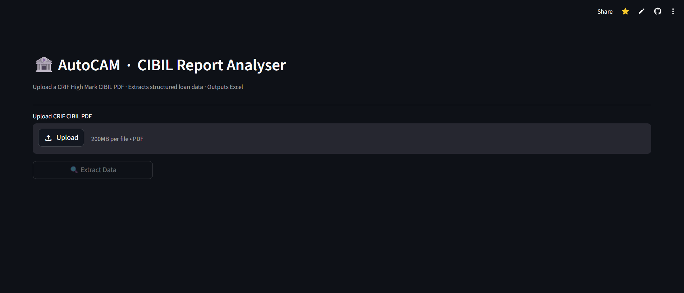
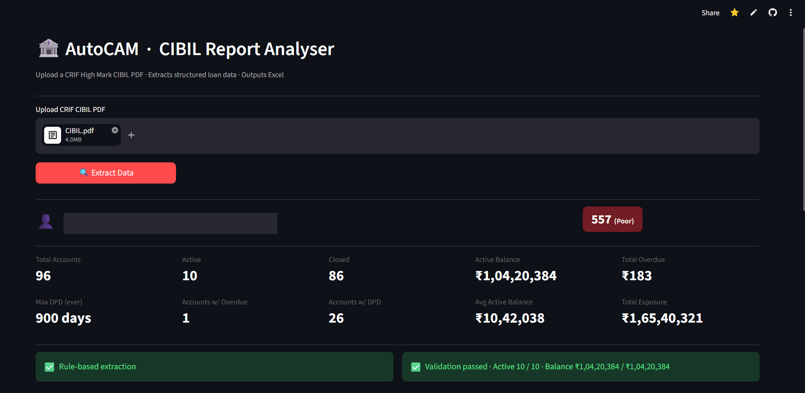
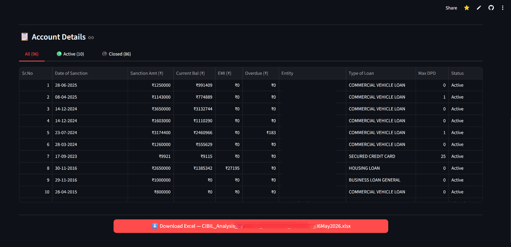

# AutoCAM  -  CIBIL Report Analyser

**Live demo: [autocam-cibil.streamlit.app](https://autocam-cibil.streamlit.app/)**

---

## The Problem

At NBFCs, credit analysts prepare a **CAM (Credit Appraisal Memo)** for every customer with exposure above ₹25 lakh. A critical section requires manually listing every active loan from the customer's CIBIL report  -  sanction amount, outstanding balance, EMI, overdue, DPD, and lender  -  formatted to a specific layout.

For a customer with 5-15 loans this takes 10-15 minutes. For a customer with **50-100+ loan accounts**, it takes 30-60 minutes of careful copy-paste, done 6-7 times per month per branch. One transposition error in a balance figure can affect the credit decision.

## The Solution

AutoCAM eliminates this entirely. Upload a CIBIL PDF → get a formatted, validated Excel file in under a minute.

- Extracts all loan accounts automatically (active, closed, written-off, and settled, with delinquent/suit-filed flagged separately)
- Covers **CRIF High Mark Retail**, **CRIF Commercial ACE**, and **TransUnion CIBIL** formats  -  PDF or raw HTML export
- Reads **scanned / image-only** reports via OCR, not just digital PDFs
- **Self-validates** every extraction against the report's own summary totals before delivering results
- On CRIF Commercial ACE reports, adds a **Credit Analysis** view alongside the account table  -  exposure vs. the rest of the market, asset-class distribution, and a derogatory-status rollup, both in the app and in the downloaded Excel
- Falls back to Gemini automatically (text correction) on CRIF Retail, and optionally to Gemini **Vision** (full re-extraction + DPD enrichment) on scanned CRIF Commercial reports  -  no user action needed for the free path, one checkbox for the paid one
- Outputs an Excel file in the exact format required for the CAM, with DPD gradient colour coding and a live SUMIF total

---

## Impact

| Metric | Before | After |
|---|---|---|
| Time per CAM (CIBIL section) | 30-60 min manual entry | < 1 minute |
| Transcription risk | High  -  manual copy-paste from PDF | Eliminated  -  validated against the report's own printed totals, not eyeballed |
| Reports with 50+ accounts | Impractical to do accurately by hand | Handled reliably, same runtime as a small report |
| Scanned / emailed PDFs | Not processable at all | OCR'd and extracted automatically, no manual retyping |
| 180-page scanned Commercial ACE report | ~400s serial OCR | ~123s with the parallel pipeline (~3.25×) |
| Fields OCR genuinely can't read (dense DPD grids) | Silently shown as 0 (wrong, undetectable) | Flagged as "Check CIBIL" so the analyst knows exactly which cell to verify |
| Analyst trust in output | No way to verify without re-reading the whole PDF | Validation badge shows pass/fail against the bureau's own arithmetic |
| Volume this replaces | 6-7 CAMs/month/branch, each 30-60 min of manual entry | Same volume, each under a minute, freeing ~3-6 analyst-hours/month/branch |

*(Speedup/accuracy figures above are the project's own measured/reported numbers from
development, not independently re-benchmarked for this README.)*

---

## Screenshots

**Upload screen**



**Borrower profile and key metrics after extraction**



**Account table with Active / Closed filter and Excel download**



---

## How It Works (User Flow)

1. Upload a CIBIL PDF (digital or scanned)
2. Click **Extract Data**
3. Review the dashboard  -  borrower name, score, account count, validation badge
4. Filter by Active / Closed accounts
5. Download the pre-formatted Excel file, ready to paste into the CAM

---

## How It's Built

### Architecture

```
PDF or HTML upload
    │
    ├─ HTML? ─────────────► parse tags to plain text (same shape as a digital PDF)
    │
    └─ PDF: Digital? ─────► PyMuPDF text extraction (instant)
       Scanned? ──────────► Tesseract OCR, parallel pipeline, geometry-reconstructed
                             + left-margin colour-strip status detection
                            │
                            ▼
                   Provider detection
                   (CRIF Retail / CRIF Commercial ACE / TransUnion)
                            │
                            ▼
                   Rule-based text parsing
                   (regex + positional/hybrid extraction, per bureau format)
                            │
                            ▼
       Self-validation against the report's own printed summary totals
               │
       ┌───────┴────────────────────────────────────────────┐
       ▼ PASS                                                ▼ FAIL
   deliver result              CRIF Retail  → Gemini text correction (stage 2/3)
                                CRIF Comml.  → Gemini Vision re-extraction (opt-in)
                                              → Gemini Vision DPD enrichment (opt-in)
                                TransUnion   → no fallback, returned as-is
                            │
                            ▼
                   Formatted Excel output (DPD gradient, live SUMIF total)
```

### Key Engineering Decisions

**Geometry-aware OCR reconstruction**
CRIF reports use a multi-column grid layout. Tesseract's default reading order splits label/value pairs across lines (`Current Balance:` ends up far from `12,34,382`). Instead of `image_to_string`, the app uses `image_to_data` (word-level bounding boxes) and re-clusters words into visual rows by y-coordinate  -  reuniting every label with its value on the same line. This was the critical fix that made scanned CRIF reports extractable.

**Self-validation as a trust layer**
Every CRIF report contains its own Account Summary table with pre-calculated totals. The app extracts these numbers and compares them against the sum of extracted account balances. A green badge means the extraction is confirmed against the bureau's own arithmetic  -  the analyst doesn't need to verify anything manually. This is what makes the output trustworthy in a regulated lending context.

**Parallel OCR pipeline**
A 180-page Commercial ACE report took ~400 seconds serially. The app now pipelines rendering (main thread, MuPDF single-threaded) with OCR (worker pool, Tesseract subprocess releases the GIL). Result: **~123 seconds on the same report  -  3.25× faster**  -  with byte-identical output by construction, since results are reassembled strictly in page order regardless of which worker finishes first.

**LLM as fallback, not primary  -  and Vision as an explicit opt-in, not automatic**
Rule-based parsing is free, instant, and deterministic; Gemini is only invoked when the report's own summary numbers say the rule-based result is wrong. On CRIF Retail, text-based correction runs in two escalating stages (block-level fix, then full re-extraction) and cascades through 4 Gemini model versions for resilience against quota limits. On CRIF Commercial scans, Gemini **Vision** re-extraction and DPD enrichment are gated behind a UI checkbox (cost/latency are shown to the user up front), and a Vision result is only adopted if it validates at least as well as the rule-based one  -  it can never make an already-good extraction worse.

**"Check CIBIL" instead of a silent wrong zero**
A field OCR genuinely couldn't read (e.g. a DPD grid cell under coloured shading) is tracked as `None`, distinct from a confidently-read `0`. The UI and Excel output both render `None` as an explicit "Check CIBIL" flag rather than a zero that looks trustworthy but isn't  -  this is also what lets Vision DPD enrichment target only the accounts that actually need re-checking.

**Colored margin strip detection**
CRIF Commercial ACE marks each account's status with a vertical colored strip in the left margin (red = active, green = closed). The app detects this via NumPy pixel analysis on the rendered page image and injects a status token into the OCR text stream  -  more reliable than the (often blank) Closure Reason / Closed Date fields.

### Tech Stack

| Layer | Technology |
|---|---|
| Web app | Streamlit |
| PDF text extraction | PyMuPDF (fitz) |
| HTML report support | Stdlib `re`/`html` (tag stripping → PDF-shaped text) |
| OCR engine | Tesseract via pytesseract, word-box (`image_to_data`) geometry reconstruction |
| Parallel OCR | Python `ThreadPoolExecutor` (rendering/OCR pipelined across a bounded queue) |
| Image processing | Pillow, NumPy (colour-strip detection) |
| LLM fallback | Google Gemini 2.5/2.0 (text + Vision) via `langchain-google-genai` |
| Excel generation | openpyxl (conditional formatting, live formulas) |
| Deployment | Streamlit Community Cloud |

### Technical Skills Demonstrated

- **Computer vision without a CV library**  -  colour-strip status detection is plain NumPy array slicing/thresholding on rendered page pixels, not OpenCV; word-box geometry reconstruction turns OCR output back into structured layout using nothing but y-coordinate clustering.
- **Concurrency with a real constraint to respect**  -  a bounded producer/consumer pipeline (`ThreadPoolExecutor` + an in-flight cap) built around a genuine thread-safety limitation (MuPDF isn't thread-safe; Tesseract-as-subprocess is), not concurrency for its own sake.
- **Defensive, self-checking data extraction**  -  every extraction is validated against numbers the source document itself printed, with an explicit `None`-vs-`0` convention so "couldn't read this" is never confused with "read this as zero."
- **Multi-format regex parsing at scale**  -  three distinct bureau report layouts (next-line label/value, inline 3-column grid, amounts-before-header), each with multiple real-world sub-variants (HTML-to-PDF page breaks, OCR noise, format-version drift), reconciled through hybrid/positional extraction strategies rather than one-off patches.
- **Applied LLM engineering**  -  a cost-aware, opt-in escalation cascade (rule-based → text LLM → Vision LLM) with prompts that encode domain-specific ground truth (the bureau's own colour convention) as a model self-check, and a "keep whichever candidate validates better" adoption rule instead of blind LLM trust.
- **Production spreadsheet generation**  -  openpyxl with conditional gradient formatting, live formulas (`SUMIF`), and print/freeze-pane setup matching an exact organizational template.

---

## Setup

```bash
pip install -r requirements.txt
streamlit run app.py
```

**Tesseract** (required for scanned PDFs):
- **Windows**: install the [UB Mannheim build](https://github.com/UB-Mannheim/tesseract/wiki). The app auto-detects `C:\Program Files\Tesseract-OCR\tesseract.exe`; for a custom path set `TESSERACT_CMD`.
- **Linux / Streamlit Cloud**: installed automatically via `packages.txt`.

**Gemini API key** (optional  -  needed only for LLM fallback):  
Set `GEMINI_API_KEY=...` in a `.env` file locally, or in Streamlit Secrets when deployed.

---

## Limitations

- OCR of a large scanned report (100+ pages) takes 2-3 minutes on a 2-core machine
- Max DPD on scanned reports is best-effort  -  Tesseract accuracy on dense payment history grids is ~80-85%; unreadable cells are flagged "Check CIBIL" rather than guessed
- TransUnion reports have no LLM or Vision fallback at all (digital, rule-based parsing only)
- Gemini Vision fallback is opt-in and per-report, not automatic  -  a scanned report that fails validation will say so and recommend Vision, but won't call it without the user ticking the checkbox
- CRIF Commercial digital reports have no LLM/Vision fallback at all yet (Vision is scanned-only); a digital Commercial report that fails validation ships flagged invalid with no automatic recovery
- A regression suite (`tests/`) checks internal-consistency invariants (not golden-value matches) against a local, gitignored folder of sample reports  -  see `CIBIL_TEST_DIR` in the repo's `CLAUDE.md`. Runtime validation-against-summary-totals remains the primary trust signal for any single extraction.
